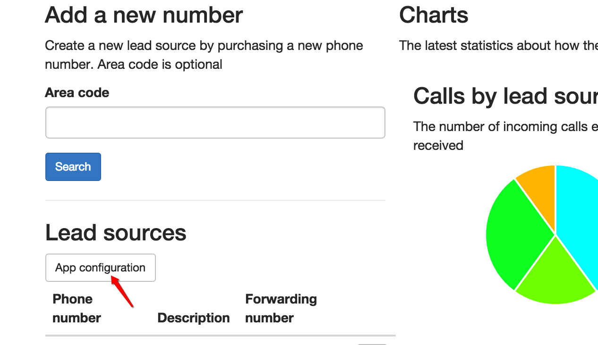
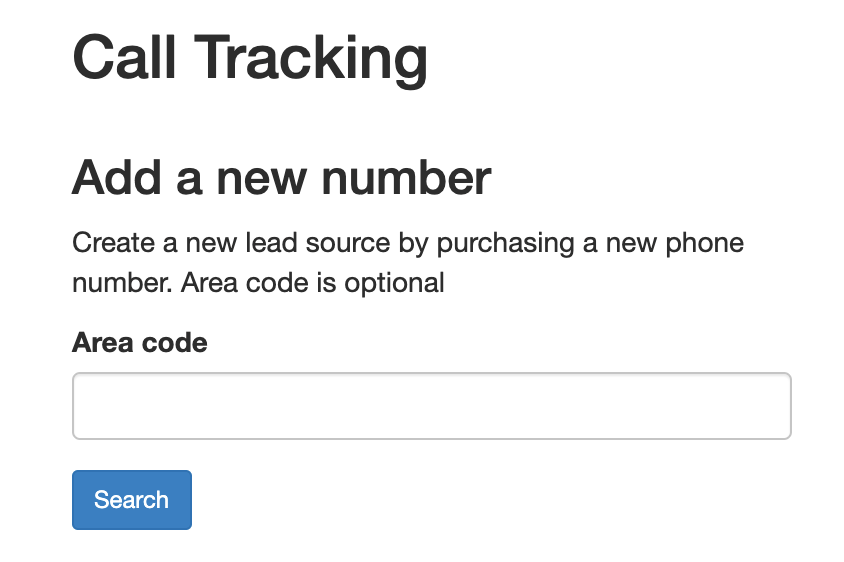
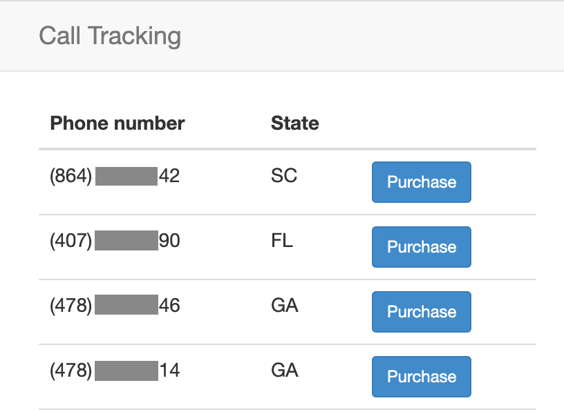
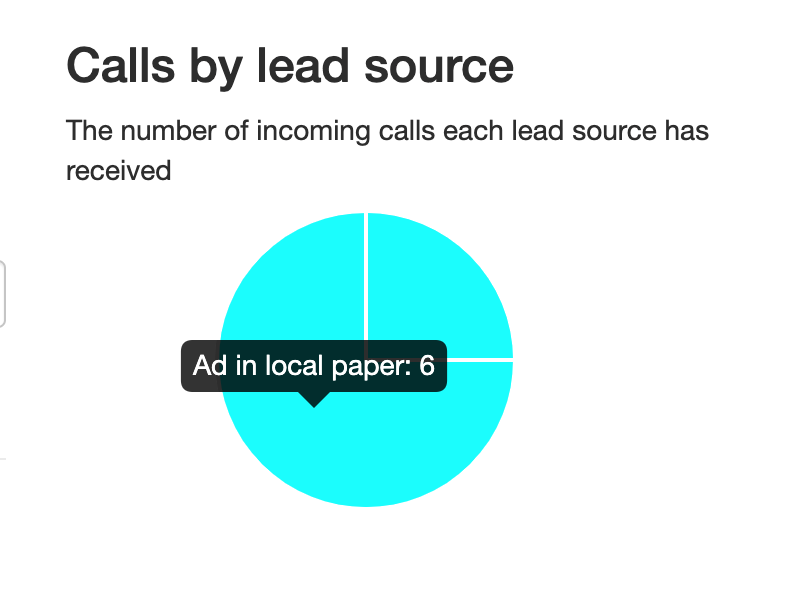

<a href="https://www.twilio.com">
  
</a>

# Call tracking

[](https://travis-ci.org/TwilioDevEd/call-tracking-node)

Call Tracking helps you measure the effectiveness of different marketing campaigns. By assigning a unique phone number to different advertisements, you can track which ones have the best call rates and get some data about the callers themselves. For a step-by-step tutorial see [twilio docs](https://www.twilio.com/docs/tutorials/walkthrough/call-tracking/node/express) to help with setting this up.

### Create a TwiML App

This project is configured to use a **TwiML App**, which allows us to easily set the voice URLs for all Twilio phone numbers we purchase in this app.

[Create a new TwiML app](https://www.twilio.com/console/voice/twiml/apps) and use its `Sid` as the `TWILIO_APP_SID` environment variable wherever you run this app.

See the end of the "Local development" section for details on the exact URL to use in your TwiML app.

Once you have created your TwiML app, [configure your Twilio phone number](https://www.twilio.com/help/faq/twilio-client/how-do-i-create-a-twiml-app). If you don't have a Twilio phone number yet, you can purchase a new number in your [Twilio Account Dashboard](https://www.twilio.com/console/phone-numbers/search).

## Local development

First you need to install
  - [Node.js](http://nodejs.org/) which should also install [npm](https://www.npmjs.com/).
  - [MongoDB](https://docs.mongodb.com/manual/administration/install-community/)
  - [ngrok](https://ngrok.com/download)

1. First clone this repository and `cd` into its directory:
    ```bash
    git clone https://github.com/TwilioDevEd/call-tracking-node.git

    cd call-tracking-node
    ```

1. Install dependencies:
    ```bash
    npm install
    ```

1. Copy the sample configuration file and edit it to match your configuration.
    ```bash
    $ cp .env.example .env
    ```
    You can find your `TWILIO_ACCOUNT_SID` and `TWILIO_AUTH_TOKEN` in your
    [Twilio Account Settings](https://www.twilio.com/console).

    Run `source .env` to export the environment variables.

1. Start the MongoDB server.

This app requires MongoDB to be running. See how to start the MongoDB service on [Windows](https://docs.mongodb.com/manual/tutorial/install-mongodb-on-windows/#start-mongodb-community-edition-as-a-windows-service), [MacOS](https://docs.mongodb.com/manual/tutorial/install-mongodb-on-os-x/#run-mongodb-community-edition), or [Linux](https://docs.mongodb.com/manual/administration/install-on-linux/) (choose your Linux distribution and then see "Run MongoDB Community Edition" in the installation instructions).

1. Run the application.
    ```bash
    npm start
    ```

    Alternatively you might also consider using [nodemon](https://github.com/remy/nodemon) for this. It works just like
    the node command, but automatically restarts your application when you change any source code files.

    ```bash
    npm install -g nodemon
    nodemon ./bin/www
    ```

1. To actually forward incoming calls, your development server will need to be publicly accessible. [We recommend using ngrok to solve this problem](https://www.twilio.com/blog/2015/09/6-awesome-reasons-to-use-ngrok-when-testing-webhooks.html). Install [ngrok](http://ngrok.com) and then run it, exposing port 3000 (the port that your local server is running on):

    ```bash
    ngrok http 3000
    ```

## Run the tests

You can run the tests locally by typing

```bash
npm test
```

### Try it out

In your Twilio app configuration you'll need to set
`http://<your-ngrok-domain>.ngrok.io/lead` as the callback URL. Open
the application and then click the "App configuration" button.



The button will take you to your TwiML call tracking
application. Under "Voice" you will find a "Request URL" input
box. There you should put the URL to the application's lead resource
(e.g `http://<your-ngrok-domain>.ngrok.io/lead`).


You can now purchase new numbers from Twilio, associate them with a lead source,
and set up call forwarding from the dashboard.

To add a new number press the "Search" button on the main dashboard. You can optionally
select an area code to find a number in that particular area.



After you click "Search", you will be shown a list of available Twilio numbers that you
can purchase. To select and purchase a number, click the "Purchase" button next
to any of the listed available phone numbers.



You will then be redirected to a form where you can label the Lead Source and
set up call forwarding. Now, when someone calls the number you have just purchased,
it will be forwarded to the number you configure under "Forwarding number".


Now, when someone calls the number you purchased and labeled, the call will display
in your dashboard as having been generated from that specific lead.



## Meta

* No warranty expressed or implied. Software is as is. Diggity.
* [MIT License](http://www.opensource.org/licenses/mit-license.html)
* Lovingly crafted by Twilio Developer Education.
